# System Architecture

---

## Mermaid Diagram

```mermaid
flowchart TD
    User([Nico — User]) -->|interacts with| UI

    subgraph UI [React Application — Browser]
        direction TB
        Onboarding[Onboarding Screen\nName · Graduation Date · OPT Status]
        Sidebar[Sidebar Navigation]

        Dashboard[Dashboard\nReadiness Score · Urgent Tasks · OPT Countdown · Category Progress]
        Timeline[Timeline\nAll tasks sorted by deadline]
        Documents[Documents Tracker\nStatus per document]
        JobTracker[Job Tracker\nApplications · Interview rounds · Next actions]
        VisaTracker[Visa / OPT Tracker\nStep-by-step OPT checklist]
        BudgetPlanner[Budget Planner\nIncome vs. expenses]
        HousingFinder[Housing Finder\nApartment options · Status]
        Contacts[Network Contacts\nConnections · Follow-up dates]
        Notes[Notes\nFreeform entries]
        AssistantPanel[Focus Assistant Panel\nTop 3 priorities · Quick stats · Tip]

        Sidebar --> Dashboard
        Sidebar --> Timeline
        Sidebar --> Documents
        Sidebar --> JobTracker
        Sidebar --> VisaTracker
        Sidebar --> BudgetPlanner
        Sidebar --> HousingFinder
        Sidebar --> Contacts
        Sidebar --> Notes
    end

    subgraph State [App State — React useState + useLocalStorage]
        Tasks[(Tasks\n14 items · 6 categories)]
        Docs[(Documents\n8 items · status per doc)]
        Jobs[(Jobs\napplications · interview rounds)]
        Profile[(Profile\nname · graduation date · OPT status)]
        OptSteps[(OPT Steps\n7 sequential steps)]
        Budget[(Budget Items\nincome + expenses)]
        Apartments[(Apartments\nstatus + notes)]
        NetworkContacts[(Contacts\nfollow-up tracking)]
        NotesList[(Notes\ntitle + content + date)]
    end

    subgraph Storage [localStorage — persisted under lb_ prefix]
        LS_Tasks[lb_tasks]
        LS_Docs[lb_documents]
        LS_Jobs[lb_jobs]
        LS_Profile[lb_profile]
        LS_OptSteps[lb_optSteps]
        LS_Budget[lb_budget]
        LS_Apts[lb_apartments]
        LS_Contacts[lb_contacts]
        LS_Notes[lb_notes]
    end

    subgraph Logic [Computed Logic — utils/helpers.js]
        ReadinessScore["calculateReadinessScore()\n(tasks × 0.5) + (docs × 0.3) + (jobs × 0.2)"]
        PriorityEngine["getTopPriorities()\nSort: overdue → deadline ≤ 3d → high priority"]
        OPTCountdown["OPT Countdown\nDerived from profile.graduationDate\n90d window · 60d grace period"]
        CategoryProgress["getCategoryProgress()\nDone/total per category"]
    end

    %% State reads/writes to localStorage
    Tasks <-->|useLocalStorage| LS_Tasks
    Docs <-->|useLocalStorage| LS_Docs
    Jobs <-->|useLocalStorage| LS_Jobs
    Profile <-->|useLocalStorage| LS_Profile
    OptSteps <-->|useLocalStorage| LS_OptSteps
    Budget <-->|useLocalStorage| LS_Budget
    Apartments <-->|useLocalStorage| LS_Apts
    NetworkContacts <-->|useLocalStorage| LS_Contacts
    NotesList <-->|useLocalStorage| LS_Notes

    %% State feeds logic
    Tasks --> ReadinessScore
    Docs --> ReadinessScore
    Jobs --> ReadinessScore
    Tasks --> PriorityEngine
    Tasks --> CategoryProgress
    Profile --> OPTCountdown

    %% Logic feeds views
    ReadinessScore --> Dashboard
    PriorityEngine --> AssistantPanel
    OPTCountdown --> Dashboard
    CategoryProgress --> Dashboard

    %% Views read state directly
    Tasks --> Timeline
    Tasks --> Dashboard
    Docs --> Documents
    Docs --> Dashboard
    Jobs --> JobTracker
    Jobs --> Dashboard
    Profile --> Onboarding
    OptSteps --> VisaTracker
    Budget --> BudgetPlanner
    Apartments --> HousingFinder
    NetworkContacts --> Contacts
    NotesList --> Notes

    %% User input writes back to state
    Dashboard -->|mark task complete| Tasks
    Timeline -->|add/edit/delete task| Tasks
    Documents -->|update doc status| Docs
    JobTracker -->|add application · log interview| Jobs
    VisaTracker -->|mark OPT step complete| OptSteps
    BudgetPlanner -->|add/edit budget items| Budget
    HousingFinder -->|add/update apartment| Apartments
    Contacts -->|add/update contact| NetworkContacts
    Notes -->|write note| NotesList
    Onboarding -->|save profile| Profile
```

---

## How to read this

**Input:** Nico interacts with any page in the app — marking a task done, logging an interview, updating a document's status.

**State layer:** Every change is held in React state and immediately synced to localStorage via the `useLocalStorage` hook. Data persists across sessions with no backend required.

**Computed logic:** Three functions run continuously across the state:
- `calculateReadinessScore()` — a weighted composite of task completion (50%), document readiness (30%), and active job applications (20%)
- `getTopPriorities()` — sorts incomplete tasks by: overdue first → deadline within 3 days → high priority → nearest deadline
- OPT countdown — derived from the user's graduation date, calculating days until the 90-day application window closes and tracking the 60-day post-graduation grace period

**Output:** The Dashboard surfaces the readiness score, OPT countdown, urgent tasks, and category progress all at once — so Nico sees his complete transition status in one view without navigating.
